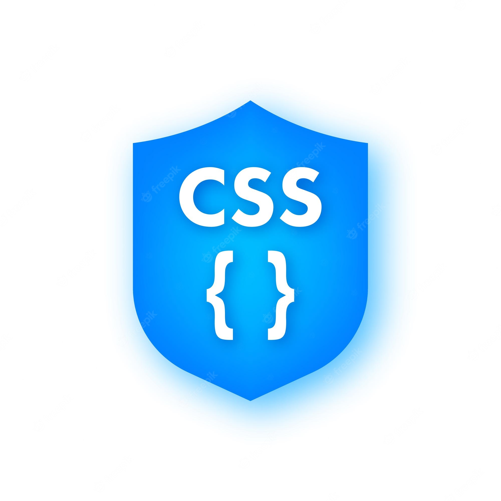
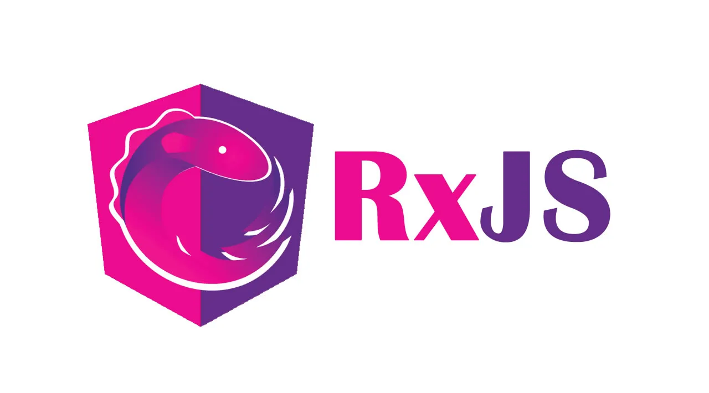

<h1 align="center">Hi 👋 -- I'm D N Singh</h1>
<h2 align="center">A full stack developer</h2>
 

  

  

### 💬 Ask me about **frontend(Angular) and Backend (Node.js)**

## work
I’m currently working in **LifeSignals**

## Connect with me:

<h3> <a href="https://www.linkedin.com/in/d-n-singh-49b85b1b2/">Linkedin</a> </h3>  
 
**asmrdnsingh@gmail.com**

## Languages:

 &nbsp;&nbsp;&nbsp;&nbsp;
 &nbsp;&nbsp;&nbsp;&nbsp;
 &nbsp;&nbsp;&nbsp;&nbsp;
 &nbsp;&nbsp;&nbsp;&nbsp;
 &nbsp;&nbsp;&nbsp;&nbsp;
 &nbsp;&nbsp;
 &nbsp;&nbsp;
 &nbsp;&nbsp;&nbsp;&nbsp;

## Framework and Libraries:

 &nbsp;&nbsp;&nbsp;&nbsp;
 &nbsp;&nbsp;&nbsp;&nbsp;
 &nbsp;&nbsp;&nbsp;&nbsp;
 &nbsp;&nbsp;&nbsp;&nbsp;
 &nbsp;&nbsp;&nbsp;&nbsp;
 &nbsp;&nbsp;&nbsp;&nbsp;
 &nbsp;&nbsp;&nbsp;&nbsp;
 &nbsp;&nbsp;&nbsp;&nbsp;

 &nbsp;&nbsp;&nbsp;&nbsp;
 &nbsp;&nbsp;&nbsp;&nbsp;
 &nbsp;&nbsp;&nbsp;&nbsp;

## Database:

